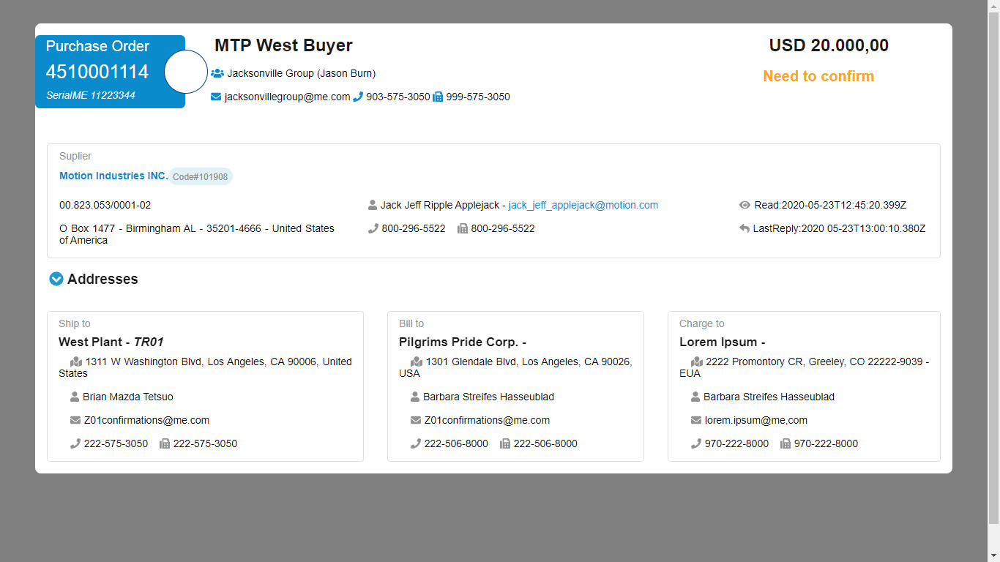

# Hello World!
### this is my participation in the frontend-challenge

### The project was developed using react

### Was separated the order screen into three parts, header, suppliers and address.

### Initially for the API integration, the axios and the map method were used.
### Hooks like useState and useEffect were also used

### For the styling, was used styled-components

### a component called card was created to generate the array addresses automatically

### Getting Started Project

# `npm install -y`

## After installation, to run use

# `yarn start` 

